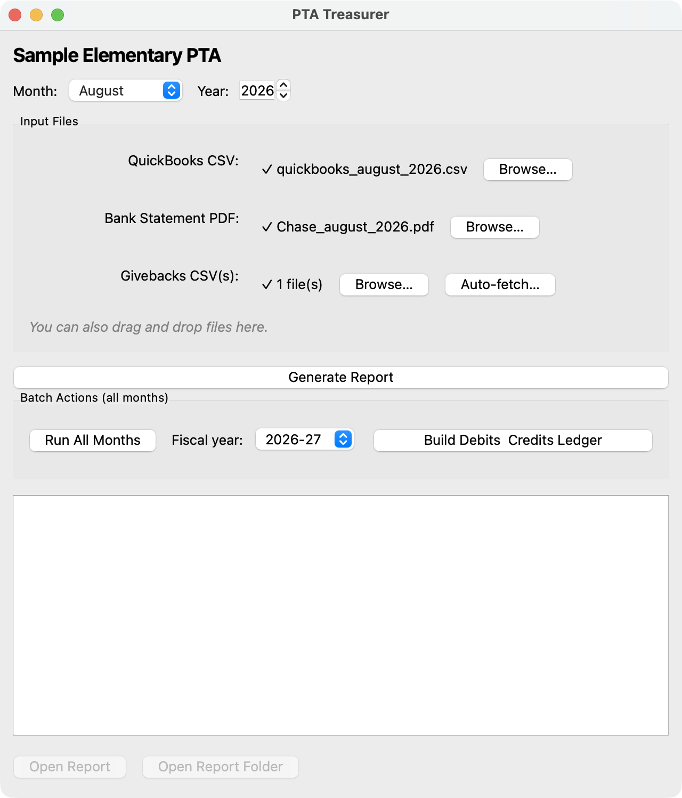

# PTA Treasurer

A cross-platform desktop app that generates monthly PTA/school treasurer
reports — income/expense vs. budget, bank reconciliation, YTD summary — from
QuickBooks, Chase bank statement, and Givebacks exports. Built for any PTA
treasurer with no Python or spreadsheet-formula knowledge, as a
from-scratch, generic rewrite of an earlier notebook-based tool.



## What it does

Point it at a folder of monthly exports and it produces a single Excel
workbook with:

- **Treasurer Report** — income/expenses for the month, bank reconciliation
- **Income / Expense Budget vs Actuals** — 12-month actuals against your
  budget, with a dynamically-computed "Last Year" column
- **Giveback Reconciliation** — fundraising platform payouts matched to the
  bank statement
- **File Manifest** — a record of exactly which input files produced the
  report
- **YTD Summary** — running balance, year-to-date totals

Optional features, off by default until configured:

- **Givebacks auto-download** — logs into your Givebacks account and pulls
  payout CSVs automatically (Playwright-based), instead of manual export
- **Pass-through fund tracking** — for money that moves through the org's
  bank account but isn't the org's own (e.g. a read-a-thon or other
  fundraiser benefiting a third party); excluded from budget totals and
  tracked separately, with a running "money held" balance
- **AI Assistant** — a chat panel for asking questions about a generated
  report or troubleshooting input-file errors, running against a local
  [Ollama](https://ollama.com) server (no cloud API, nothing leaves your
  machine)
- **Debits & Credits ledger** — a whole-fiscal-year check-register-style
  workbook, rebuilt on demand from every month's input folder

See [`docs/sample_output/`](docs/sample_output/) for example generated
workbooks (built entirely from the synthetic data in `sample_data/` — no
real financial data is included anywhere in this repo).

## Getting started

```sh
python -m venv .venv && source .venv/bin/activate
pip install -e ".[dev]"             # core + test/packaging tooling
pytest                              # run the test suite
pta-treasurer                       # launch the GUI
```

First run walks you through a setup wizard: pick a data folder, name your
org, and (optionally) import a budget template. See
[`packaging/README.md`](packaging/README.md) for building a standalone
`.app`/`.exe`.

### Trying it with sample data

`sample_data/July_1999/` is a complete synthetic month (fake org, fake
year, no real names or accounts) — QuickBooks export, Chase PDF, and
Givebacks CSVs — safe to point the app at to see the whole pipeline run
end to end.

## Project layout

- `src/pta_treasurer/parsers.py` — QuickBooks/Chase/Givebacks file parsing
- `src/pta_treasurer/builders.py` — styled Excel worksheet construction
- `src/pta_treasurer/pipeline.py` — orchestrates a month's report end to end
  (used by both the CLI and the GUI)
- `src/pta_treasurer/config.py` — org config, budget-io, month/fiscal-year
  helpers
- `src/pta_treasurer/gui/` — the PySide6 desktop app
- `src/pta_treasurer/ai_assistant.py` — the optional local-LLM chat backend
- `packaging/` — PyInstaller specs for macOS/Windows

See [`PLAN.md`](PLAN.md) for the original design/build-order notes.

## Real financial data

Real input files, generated reports, and history are never committed —
`input/`, `output/`, `data/`, and `logs/` are gitignored, along with any
loose `*.xlsx`/`*.pdf`/`*.csv`. The only data checked into this repo is
synthetic: `tests/fixtures/` (unit test fixtures), `sample_data/July_1999/`
(a full synthetic demo month), and `docs/sample_output/` (example reports
generated from that same synthetic month).
